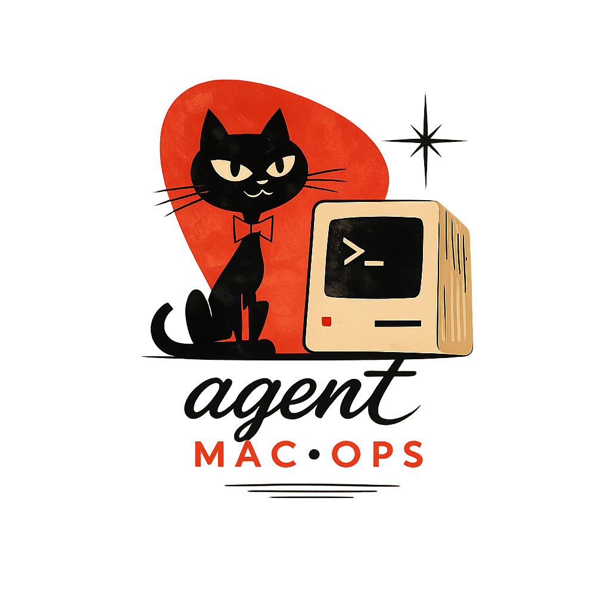

<p align="center">
  
</p>

<h1 align="center">agent-mac-ops</h1>

<p align="center">
  <b>Operate your always-on Mac by talking to an AI agent —<br>and work on it remotely like you're sitting right in front of it.</b>
</p>

## Features

- 🤖 **Drive it with an AI agent.** Point Claude or Codex at `control/ops/` and say *"check on the box"* —
  it SSHes in, reports uptime / disk / load / dev-session health in plain language, and revives a wedged
  session. No SSH commands typed by you.
- 🖥️ **Native remote terminal sessions.** One command opens the remote as native, resizable panes — real
  `Cmd+D` / `Cmd+T` splits connected to the remote, normal keys, auto-colored so you never confuse it
  with localhost. Works in **iTerm2** (`tmux -CC`) and **Ghostty** (native splits), auto-detected.
  ([how it's done →](SETUP.md))
- ⚡ **Instant-feeling typing on slow links.** `box-mosh` connects over [mosh](https://mosh.org) for
  predictive local echo, so characters appear immediately even over high latency.
- 🔐 **Log in without Screen Sharing.** Remote auth pages open on *your* Mac, and OAuth `localhost`
  callbacks reach the right machine — ports are forwarded automatically and remote browser opens are
  handed back to your laptop. ([details →](docs/REMOTE-AUTH.md))
- 📋 **Clipboard bridge (optional).** Enable `install-clip-watch.sh` and screenshots you copy locally
  auto-mirror to the remote's clipboard — `Ctrl+V` them straight into a tool running on the remote.
  Prefer no background watcher? Push on demand with `box-clip`.
- 🧑‍💻 **`code .` for the remote.** Run `code-box` in the remote session and your laptop's Cursor (or
  VS Code) opens in Remote-SSH mode at that folder — so the editor runs locally, on the remote's files.
  Or `box-code` from a cold laptop shell, no session needed. Reuses the handoff listener.
- 📦 **Painless file transfer & forwarding.** `box-push` / `box-pull` move files without typing the host;
  `box-fwd` forwards ad-hoc ports (including random OAuth callbacks).
- 🔪 **Reclaim a busy port in one keypress.** `ports` opens an fzf picker of every local TCP listener —
  port, PID, owner, and a live preview of the full process — then `Enter` kills the holder (graceful
  SIGTERM, with SIGKILL escalation if it clings on). `ports 3000` targets one directly. Perfect for the
  stale dev server or orphaned SSH tunnel squatting on `:3000` before `bun dev`.
- 📊 **Optional daily health digest** to Slack / Discord / any webhook.

## The problem

You've got a Mac that never sleeps — a Studio under the desk, an old MacBook on a shelf — and you want
to actually *use* it from your laptop. In practice that means a pile of `ssh` one-liners, Screen Sharing
that feels like molasses, remote shells that don't behave like local ones, and logins that break because
the OAuth callback points at the wrong machine. When the dev session wedges, you're the one SSHing in to
debug it.

agent-mac-ops turns that always-on Mac into something you operate by *talking to an agent* and connect to
as a native-feeling session — as close to "sitting in front of it" as a remote box gets.

## Requirements

- **macOS + iTerm2 _or_ Ghostty** on the control machine — for the native-window magic. iTerm2 uses
  `tmux -CC` (Terminal.app won't do it, WezTerm only partially); Ghostty (≥ 1.2.0) uses native splits
  that each auto-ssh in. `box` auto-detects which you're using. *(The agent-ops half —
  status/logs/revive/digest — is plain SSH + bash and works against any host.)*
- **tmux** on the remote (`brew install tmux`).
- **mosh** (optional, for `box-mosh`) on both ends — `./setup.sh remote` installs it on the remote;
  `brew install mosh` locally. Needs UDP 60000–61000 reachable (Tailscale carries it).
- **SSH reachability** to the remote. [Tailscale](https://tailscale.com) is the recommended way (no
  public exposure, works from anywhere) but anything your `ssh` can reach is fine — just put a Host
  alias in `~/.ssh/config` and use its name.
- `python3` and `curl` on the control machine (both ship with macOS) for the optional webhook digest.

## Quickstart

```bash
git clone https://github.com/dupe-com/agent-mac-ops && cd agent-mac-ops
./setup.sh            # prompts for host, hostname, dirs, alias, webhook → writes config.env
./setup.sh remote     # pushes the dev-session launcher to the remote

# add to ~/.zshrc, BEFORE your iTerm2 shell-integration line:
source /path/to/agent-mac-ops/control/shell-snippet.sh

# iTerm2: follow SETUP.md for the profile + Automatic Profile Switching (the coloring)
# Ghostty: nothing else to do — see SETUP.md §4b
```

Now:

- **`box`** (or whatever alias you chose) → native, colored window into the remote (iTerm2 `-CC`
  panes, or Ghostty native splits — auto-detected). Ghostty adds **`box-tmux`** for a persistent
  session that survives disconnect.
- **`box-mosh`** (either terminal) → connect over mosh for snappy, predictive typing when the link is
  laggy. Single session + tmux for persistence; forwards/handoff still ride the SSH master.
- **Point your agent at `control/ops/`** and say *"check on the box."*
- **Browser handoff:** `control/bin/install-open-listener.sh` so remote auth pages open on your Mac.
- **Clipboard auto-mirror:** `control/bin/install-clip-watch.sh` so screenshots you copy here land on
  the remote's clipboard automatically — `Ctrl+V` them in a tool on the remote, no command in between.
- **Open the remote in your local editor:** inside the session, `code-box` (current dir) opens Cursor/
  VS Code on your Mac in Remote-SSH mode; from a local shell, `box-code [path]`. Needs the handoff
  listener (`install-open-listener.sh`) and the host in your `~/.ssh/config`.
- **`ports`** → interactive fzf picker of every TCP port being listened on locally, who owns it, and one
  keypress to kill the holder (Tab = multi-select). `ports 3000` targets a port directly. Local-only —
  no alias prefix — for clearing a stale dev server or orphaned tunnel before `bun dev`.
- **Optional:** `control/ops/bin/install-launchd.sh` for a daily health digest.

## How it works

```
control machine (your laptop)                     always-on Mac (the remote)
─────────────────────────────                     ──────────────────────────
shell-snippet.sh  → `box` ───────── ssh -t ───▶   ~/dev-session.sh
   (iTerm2)                                          └─ tmux -CC attach  ──▶ native iTerm2 windows
   (Ghostty) ghostty-connect.sh ─── ssh -t ───▶      └─ login shell / tmux ─▶ native Ghostty splits
   (mosh)    `box-mosh` ───────── mosh/UDP ────▶      └─ tmux attach ───────▶ predictive-echo session
control/ops/AGENTS.md  ← your agent reads this
control/ops/bin/remote-run.sh ── ssh + stdin ──▶   status.sh / logs.sh / revive.sh (run, then gone)
control/ops/bin/daily-check.sh ── launchd ──▶      webhook digest (Slack/Discord/…)
open-listener.py  ◀── reverse tunnel (-R) ─────    ~/bin/open shim (opens auth URLs on your Mac)
your localhost:3000  ◀── forward (-L) ─────────    remote dev server / OAuth callback
```

- **Config lives in one file.** `config.env` (gitignored, written by `setup.sh`) holds the host,
  hostname, work dir, alias, webhook, etc. Every script sources it; the two `*.tmpl` files are
  rendered from it.
- **The remote stays stateless.** Only `~/dev-session.sh` lives there. The health scripts are
  *shipped over SSH on stdin* with config prepended, so there's nothing to install or keep in sync.
- **No secrets in git.** The only optional secret is the notify webhook, and it lives in the
  gitignored `config.env`. Use a webhook URL, never a bare token.

## What this is *not*

Deliberately small. It does **not** sync dotfiles, manage packages, or sync editor settings — use
[`chezmoi`](https://github.com/twpayne/chezmoi) / [`yadm`](https://yadm.io) / GNU `stow` for that.
This repo is just the above: agent-operable + a native-feeling remote session.

## License

MIT — see [LICENSE](LICENSE).
